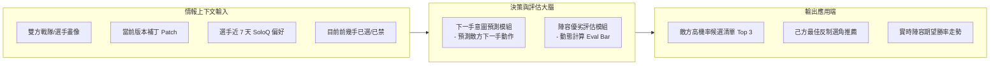

# 英雄聯盟 AI BP 預測與勝率評估系統 (LoL Draft AI)

> 具備職業教練與數據分析師思維的英雄聯盟（League of Legends）即時 BP（Ban/Pick）決策、預測與陣容優劣評估系統。

---

## 壹、 專案定位與核心願景

本專案旨在打造一套具備**職業教練與數據分析師思維**的英雄聯盟（League of Legends）即時 BP（Ban/Pick）決策、預測與陣容優劣評估系統。

專案採取**「兩階段演進策略」**：
1. **第一階段（主幹核心）**：以**全球職業聯賽數據**結合**職業選手高分段天梯（韓服/超級服 SoloQ）動態**為核心，實現賽前沙盤推演、賽中即時 BP 預測與陣容評分（Eval Bar），以及賽後復盤歸因。
2. **第二階段（業務延伸）**：將第一階段訓練成熟的「陣容質量評估大腦」下放至**一般玩家排位賽**場景，結合個人英雄熟練度與單線剋制，提供輕量化的選角輔助。

---

## 貳、 系統架構規劃樹（Work Breakdown Structure）

```
LoL-Draft-AI (系統規劃樹)
│
├── 📁 模組一：數據資產規劃（情報輸入端）
│   ├── 1.1 職業賽事情報庫
│   │   ├── 全球賽區（LCK / LPL / LEC / LCS 等）歷史對局庫
│   │   ├── 完整 20 輪 Ban/Pick 精確輪次日誌 (Turn 1 ~ Turn 20)
│   │   └── 戰隊戰術風格標籤（紅藍方勝率、前期血腥度、平均比賽時間）
│   │
│   ├── 1.2 職業選手情報庫
│   │   ├── 選手職業生涯歷史英雄池與招牌角（Signature Picks）
│   │   └── 選手高分天梯（韓服/超級服 SoloQ）即時動態追蹤
│   │       ├── 近期（3~7 天）練角頻率突增預警（黑科技/練角預測）
│   │       └── 選手個人天梯勝率與盲選信心指數
│   │
│   └── 1.3 版本環境情報庫 (Patch Meta)
│       ├── 當前版本全域出場率、禁用率（P/B Rate）
│       └── 版本 T0/T1 英雄分級矩陣與機制影響權重
│
├── 📁 模組二：AI 決策與評估大腦（分析計算端）
│   ├── 2.1 陣容綜合評估器（「誰的陣容更好？」）
│   │   ├── 陣容即時勝率期望值（0% ~ 100%）
│   │   ├── 陣容形勢評估值（類似西洋棋 Eval Bar：+1.5 藍優 / -1.2 紅優）
│   │   └── 陣容五維屬性雷達（對線強度、開團、清線、傷害分佈、後期曲線）
│   │
│   └── 2.2 下一手 BP 預測與推薦器（「接下來怎麼選/禁？」）
│       ├── 敵方意圖預測：預測對手下一手最可能鎖定/禁用的 Top 3 英雄
│       └── 己方最優解推薦：計算能使「終局勝率最大化」的選角反制建議
│
├── 📁 模組三：第一階段產品規劃（職業賽事專屬面版）
│   ├── 3.1 賽前沙盤推演
│   │   └── 輸入雙方戰隊，自動推演「雙方最可能交鋒的 3 套標準 BP 劇本」
│   ├── 3.2 實時觀賽 / BP 演練助手
│   │   └── 伴隨每手選角，動態刷新勝率評估條與即時應對策略
│   └── 3.3 賽後複盤與歸因
│       └── 自動評估兩隊教練的 BP 得失分（量化 BP 優劣 vs 選手局內發揮）
│
└── 📁 模組四：第二階段延伸規劃（一般玩家排位輔助）
    ├── 4.1 選角自動感知
    │   └── 進入遊戲選角階段自動喚醒，辨識敵我雙方位置與已選角色
    ├── 4.2 排位專屬推薦引擎
    │   ├── 結合玩家個人英雄熟練度（避免推薦不會玩的角色）
    │   └── 單線對線強勢剋制優先（弱化團隊體系，強化個人對線滾雪球）
    └── 4.3 輕量化桌面展示
        └── 懸浮小窗呈現陣容缺口提醒（例：缺少開團、全 AD 菜刀隊預警）
```

---

## 參、 模組規劃與功能定義

### 一、 數據資產層規劃

#### 1. 職業賽事與選手情報體系
* **歷史賽事維度**：
  * 版本（Patch）標籤化：任何數據必須與遊戲補丁版本綁定，避免跨大版本產生誤導。
  * 紅白方選邊差異：記錄各隊伍在藍方（首選優勢）與紅方（Counter 位優勢）的選角傾向。
* **選手個人高分天梯（SoloQ）情報鏈**：
  * **黑科技/突發練角預警**：賽前若選手在韓服連續使用冷門或新興英雄，系統給予高權重預警。
  * **英雄池深度限制**：若某版本 T0 角色選手近期天梯完全不碰或勝率極低，標記為隊伍潛在的自 Ban 劣勢點。

#### 2. 特徵標籤庫
* **英雄角色標籤**：定位、主傷害屬性（物理/魔法/真實）、開團（Engage）能力等級、反手（Disengage）能力等級、前期壓制力、後期發力點。
* **組合關聯度**：英雄搭配勝率（經典 Combo、體系搭檔）與英雄剋制關係（對線勝率差、對位經濟差）。

---

### 二、 AI 決策與評估大腦規劃



#### 1. 陣容優劣評估器（Draft Value Network）
* **輸入**：藍方 5 人組合 + 紅方 5 人組合 + 版本環境 + 雙方歷史戰力。
* **評估輸出**：
  1. **數值化評估分（Eval Bar）**：例如 `+1.8（藍方陣容大優）`，轉化為期望勝率。
  2. **勝率曲線隨時間預測**：分為「前 15 分鐘前期節奏勝率」與「30 分鐘後後期團戰勝率」。
  3. **陣容失衡預警**：缺乏清線、全 AD、缺乏硬控、缺乏前排坦度等結構性問題。

#### 2. 即時 BP 預測與推薦器（Real-time Draft Policy）
* **預測敵方**：模擬敵方教練思維，綜合考慮「版本強勢度 + 選手擅長 + 當前陣容缺口」，預測其接下來最可能鎖定/封鎖的對象。
* **推薦己方**：計算在當前剩餘可用英雄池中，選取哪一隻能使己方的終局陣容期望勝率提升幅度最大（Max-WinRate Gain）。
* **搖擺位識別（Flex Pick）**：若對方鎖定可走多路的英雄（如藍寶、波比、庫奇），系統自動計算其走向各路的機率，並提示防守策略。

---

### 三、 第一階段產品形態：職業賽事工作台

1. **賽前模擬（Pre-match Sandbox）**：
   * 使用者選擇對陣雙方（例如：T1 vs GEN），系統根據雙方選手近期天梯動向與賽季英雄池，自動生成多套推演劇本。
2. **實時觀賽助手（Live Match Companion）**：
   * 觀看官方賽事直播時，使用者可手動同步即時 BP，系統即刻顯示 AI 推薦與實際教練選角的差異度，並呈現動態形勢條。
3. **賽後複盤工具（Post-match Debrief）**：
   * 針對已結束的比賽，量化兩隊在 BP 階段的得失分，給出陣容優勢方評定，輔助賽後戰術檢討。

---

### 四、 第二階段產品形態：一般玩家排位輔助

1. **場景差異化設計**：
   * 移除職業賽事的「團隊體系過度依賴」，改為聚焦**「個人線路剋制」**與**「個人歷史熟練度」**。
2. **智慧補位與排位專屬功能**：
   * 當隊伍已有 4 人鎖定時，為最後一名玩家推薦既符合其個人常用英雄池，又能補足陣容屬性（如補法傷、補開團）的角色。
3. **輕量化產品體驗**：
   * 以不干擾遊戲畫面的懸浮視窗為主，自動感知遊戲選角流程，即時提供反制建議。

---

## 肆、 專案里程碑規劃（Milestones）

| 里程碑 | 核心目標 | 驗收交付物 |
| :--- | :--- | :--- |
| **M1: 數據底座與標準化** | 完成職業比賽庫與選手天梯追蹤機制規劃 | 1. 全球主要賽區賽事 BP 日誌數據集<br>2. 職業選手天梯帳號情報映射表 |
| **M2: 陣容評估大腦構建** | 完成 5v5 陣容好壞的評分體系 | 1. 陣容勝率與評分模型 (Eval Bar)<br>2. 陣容五維雷達與前後期曲線評估 |
| **M3: 即時 BP 推演功能成型** | 完成下一手預測與己方反制推薦 | 1. 敵方選角預測 Top 3 清單<br>2. 賽前沙盤推演與即時模擬引擎 |
| **M4: 職業觀賽/分析平台交付** | 整合第一階段所有功能至視覺化 Web 介面 | 1. 職業賽事情報與 BP 模擬平台<br>2. 歷史比賽 BP 複盤報告功能 |
| **M5: 排位賽輔助拓展 (Phase 2)** | 下放陣容評估能力至玩家單排場景 | 1. 排位選角感知與個人熟練度加權邏輯<br>2. 輕量化客戶端互動方案 |
